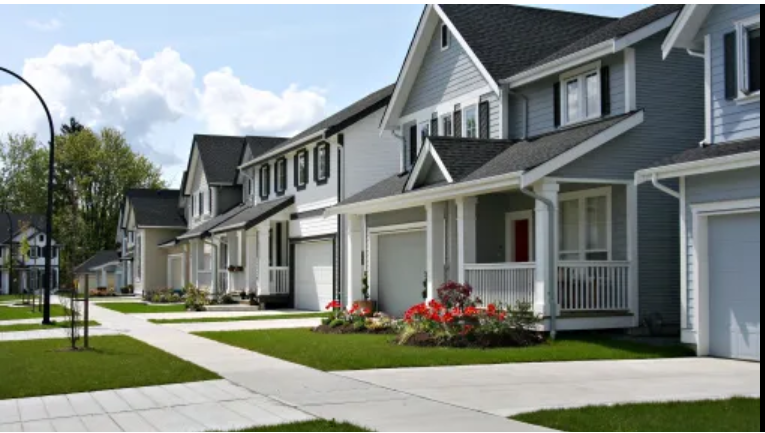
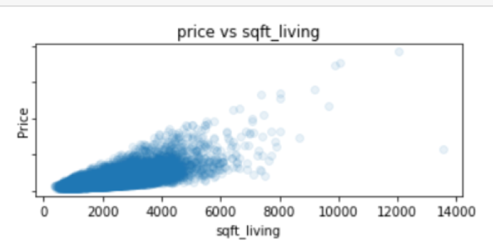
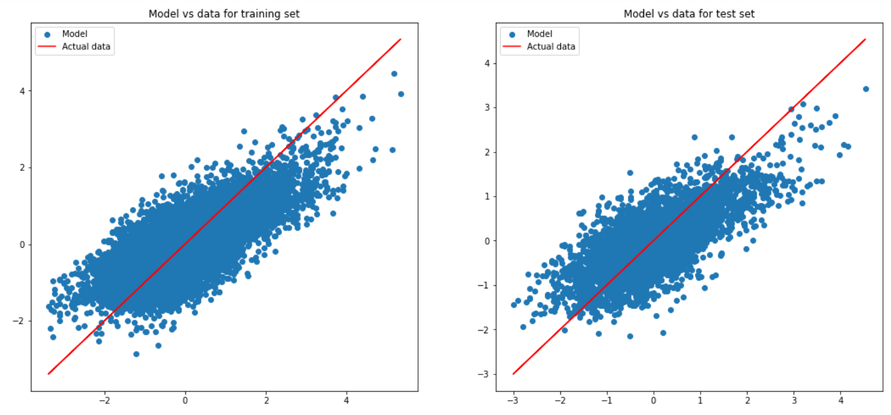
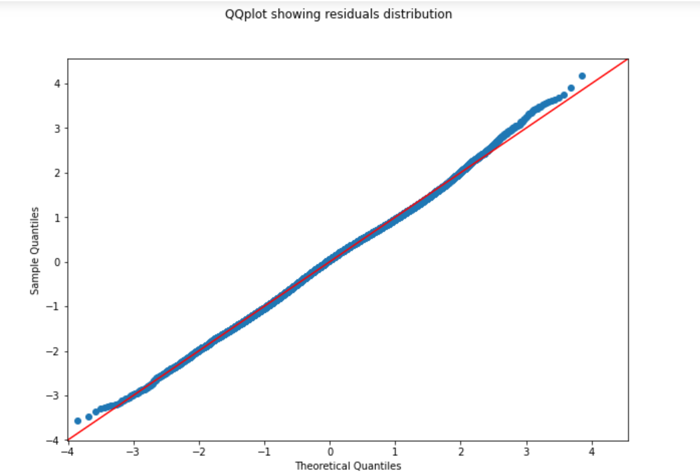
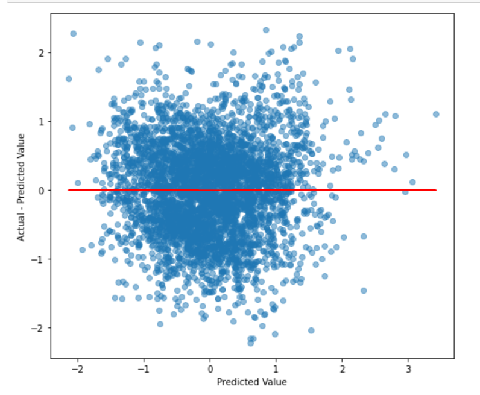

# KING COUNTY HOUSING PRICE PREDICTION

Author: Scholar Chepkirui
<<<<<<< HEAD

=======
>>>>>>> 0140d4c714f9079cca84de612fc9f32441d94a83

## Project overview
This project uses regression modeling to analyze house sales in King County. The final model can predict the price of a house based on various features, hence it will be used by a real estate agency to establish a realistic asking price. The findings from the model shows the house features that have a great impact on the price of a house based on past sales. These findings can be used by the real estate agency to advise homeowners on any improvements that can be made to increase the house price.  

## Business Problem

There is a real estate agency in King County that helps homeowners sell homes. The agency has 18 house unique features that it considers when estimating the value of a house. Due to the many house features available, the real estate agency has a difficulty in establishing a realistic asking price. Additionally, the real estate agency advises homeowners on how to increase the estimated value of their homes, such as by doing home renovations. However, they are not really sure if the advice given has a great impact on the house price value.  
This project aims to build a  model that  can predict the price of a house based on various features. This helps the agency in coming up with a realistic asking price. The findings obtained while building the model provides insights on the house features that have a greater impact on house price. From these findings, the agency can appropriately advise the homeowner on any improvements that can be made to increase the house price. 

## Data
This project uses the King County House Sales dataset. The dataset has columns such as date, price, floors, sqft_living,  bedrooms, waterfront, sqft_lot, condition, grade, yr_built, yr_renovated, sqft_basement, sqft_lot15 and sqft_living15.
<<<<<<< HEAD

## Methods
The main method used in this project is regression modeling. The steps taken include:
- Business understanding
- Data understanding
- Data processing
- Modeling

## Results
Sqft_living has the highest positive correlation with price. The baseline model was thus built using sqft_living as the only predictive feature.

The final model had the highest R-value and the lowest MSE errors when compared to other models. Multiple features such as sqft_living, floors,  bedrooms, waterfront, house_age, sqft_lot,  condition and renovations were used in this model.
The linear regression assumptions were investigated using this model in order to understand how much the model violates the assumptions.

### Investigating linearity

Based on the training set and the test set, there is a linear relationship between the target variable and the predictors.

### Investigating Normality

The model residuals have a normal distribution.

### Investigating Homoscedasticity

The shape above is not cone-like, hence the homoscedascity assumption is met. The residuals are almost equal across the regression line.

## Conclusions and recommendations
The final model will mainly be used for predictive purposes. 
It can also be used for inferential purposes since none of the assumptions of linear regression has been violated. Most of the house features were found to have a significant effect on the price of houses.
When various features were selected using various methods, the performance of the model was lower than that of the model with all the predictive features. The house features used for prediction, with a significant effect on the price value include floors, sqft_living, bedrooms, waterfront, sqft_lot, condition, renovations and house_age.
The real estate agency should advise the homeowners to renovate their homes before selling in order to improve the sale price of the house.

## Future work
- Other types of modeling other than linear regression should be applied to determine the model that has the highest performance.
- In the real estate industry, the price of houses may be affected by other factors such as consumer sentiment, credit availability, inflation and other economic factors. Data should be collected on these external factors and the model adjusted based on the effects of these factors.

##  For More Information
See the full analysis in the [Jupyter Notebook](https://github.com/Scholarchep/King-County-housing-price-predictions/blob/main/student.ipynb) or review this [presentation](https://github.com/Scholarchep/King-County-housing-price-predictions/blob/main/presentation.pdf).
For additional information, contact Scholar Chepkirui at scholarchepkirui@gmail.com

## Repository Structure
<<<<<<< HEAD

├── images                                    <- Both sourced externally and generated from code
├── data                                      <- Both sourced externally and generated from code
├── README.md                                 <- The top-level README for reviewers of this project
├── presentation.pdf                          <- PDF version of project presentation
└── student.ipynb                             <- Narrative documentation of analysis in Jupyter notebook
=======
>>>>>>> 0140d4c714f9079cca84de612fc9f32441d94a83
